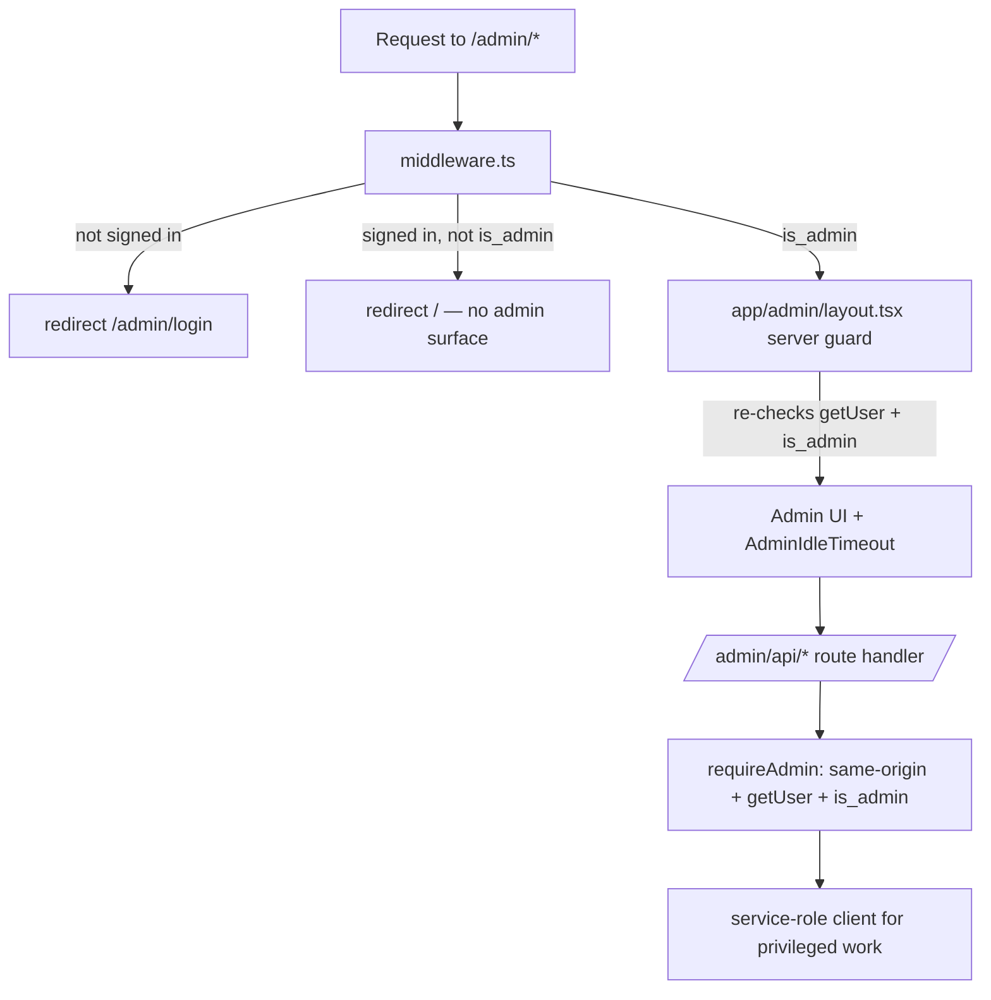

# Bantle Web (marketing site + admin panel)

This repository is the **Next.js web app for Bantle**. It serves two very
different audiences from one codebase:

1. **Public marketing + legal site** (`/`, `/about`, `/faq`, `/privacy`,
   `/terms`, …) — statically rendered pages plus the App Store / Play
   Store legal URLs, account-deletion and child-safety pages, and the
   `/verify` and `/reset-password` flows linked from the mobile app.
2. **Internal admin panel** (`/admin/*`) — a Supabase-authenticated,
   admin-only operations console for trust/verification review, user
   moderation, listings/deals oversight, reports, platforms, broadcasts,
   and an audit log.

> The Bantle **mobile app** lives in a separate repo
> (`~/Documents/GitHub/bantle/`). Both apps talk to the **same Supabase
> project / Postgres database**. This web repo is the *only* place that
> uses the Supabase **service-role** key, and only inside server-side
> admin API routes.

This README is written for two audiences:

| Reader | What this README should help with |
| --- | --- |
| A new developer | Understand the two surfaces, the auth/security model, the folder layout, the shared database, and how to run/deploy. |
| A non-technical teammate | Understand what the public site and the admin panel do, and why some rules matter. |

Do not put secrets, API keys, service-role keys, tokens, signed URLs, or
personal account data in this README.

---

## 1. The two surfaces at a glance

```mermaid
flowchart TD
  subgraph Public[Public marketing + legal]
    M1[/ home/]
    M2[/about /how-it-works /safety /faq /support/]
    M3[/privacy /terms /refund-policy /community-guidelines/]
    M4[/account-deletion /child-safety-standards/]
    M5[/verify /reset-password  - linked from mobile app/]
  end
  subgraph Admin[/admin/* — Supabase auth, admin only]
    A1[Login]
    A2[Dashboard]
    A3[Users / ban / restore]
    A4[Identity verifications]
    A5[Name-change requests]
    A6[Listings / Deals / Reports]
    A7[Platform requests]
    A8[Platforms / Broadcasts / Settings / Audit]
  end
  Public --> DB[(Supabase / Postgres)]
  Admin --> DB
```

The public surface is mostly static and unauthenticated. The admin surface
is fully gated (middleware + server checks) and performs privileged work
with the service-role key.

**Admin email alerts (server-side, lives in the mobile/core repo):** since
2026-08-25, whenever a new item enters a review queue handled by this panel
(platform request, identity verification submission, name-change request,
user report), database triggers enqueue an alert and a pg_cron-driven
`admin_email_dispatcher` Edge Function emails every active admin a digest
within ~2 minutes (Resend API, sender `alerts@bantle.in`). Nothing in this
repo sends those emails — the infrastructure is defined in
`../bantle/supabase/` — but panel operators should expect email deep links
into `/admin/platform-requests`, `/admin/identity-verifications`,
`/admin/name-change-requests`, and `/admin/reports`.

---

## 2. Tech stack

Values come from `package.json`.

| Tool | Version | Why |
| --- | --- | --- |
| Next.js (App Router) | `^16.2.6` | Framework. Server components by default; route handlers for admin APIs. |
| React / React DOM | `^18` | UI library. |
| TypeScript | `^5` (strict) | Types. |
| Tailwind CSS | `^3.4.1` | Styling with a custom Bantle token palette (`tailwind.config.ts`). |
| `@supabase/supabase-js` | `^2.105.4` | DB/auth client. |
| `@supabase/ssr` | `^0.10.3` | Cookie-based server client for middleware + route handlers. |
| `@radix-ui/react-dialog` | `^1.1.15` | Mobile nav sheet + admin dialogs. |
| `lucide-react` | `^1.14.0` | Icons. |
| `class-variance-authority`, `clsx`, `tailwind-merge` | — | `cn()` helper + variant styling. |

Fonts via `next/font/google`: Bricolage Grotesque (display), Geist (body/UI),
Geist Mono (numerals and micro-labels). Lora is still loaded, `preload: false`,
solely for the admin panel's `font-serif` headings.

The shared social card is generated with `next/og` at the stable path
`/og.png`, and referenced from `lib/seo.ts` (`OG_BASE`, `TWITTER_BASE`). It is
deliberately not Next's hashed `opengraph-image` file convention: a page that
declares its own `openGraph` block opts out of that convention and would ship
with no image at all.

---

## 3. Local development

```bash
npm install
npm run dev          # http://localhost:3000
```

Scripts:

```bash
npm run build        # production build — must finish with 0 errors
npm run start        # serve the production build
npm run lint         # eslint .
npx tsc --noEmit     # typecheck (no emit)
```

Environment variables (set in Vercel project settings; `.env` is gitignored):

| Variable | Surface | Notes |
| --- | --- | --- |
| `NEXT_PUBLIC_SUPABASE_URL` | public + server | Same Supabase URL as the mobile app. Safe to expose. |
| `NEXT_PUBLIC_SUPABASE_ANON_KEY` | public + server | Anon/publishable key. Safe to expose. |
| `SUPABASE_SERVICE_ROLE_KEY` | **server only** | **MUST NOT** have a `NEXT_PUBLIC_` prefix. Bypasses RLS. Used only in admin API routes. |

Never commit `.env`, service-role keys, tokens, or backups.

---

## 4. Project layout

```
app/
├── layout.tsx                    Root layout: fonts + global metadata (title/OG/Twitter/JSON-LD base)
├── globals.css                   Tailwind directives + .prose-bantle
├── robots.ts                     Disallows /admin, /verify, /reset-password
├── sitemap.ts                    Public-only routes
├── icon.png / apple-icon.png     Favicons (auto-served)
├── (marketing)/                  PUBLIC pages (route group, shares marketing layout)
│   ├── layout.tsx                Header + Footer chrome
│   ├── page.tsx                  Landing (/) — hero, JSON-LD (@context + @graph)
│   ├── about, how-it-works, safety, faq, support
│   ├── privacy, terms, refund-policy, community-guidelines
│   ├── account-deletion, child-safety-standards
│   ├── verify/ (+ VerifyClient.tsx)        noindex; email verification landing
│   ├── reset-password/ (+ ResetPasswordClient.tsx)  noindex, no-store; password reset
│   (social card lives at app/og.png/route.tsx)
└── admin/                        ADMIN panel (gated)
    ├── layout.tsx                Server layout: getUser + is_admin guard; mounts AdminIdleTimeout
    ├── login/                    Admin login page
    ├── page.tsx                  Dashboard
    ├── users/ [id]/              User list + detail (tabs: listings/deals/reports/audit)
    ├── identity-verifications/ [id]/   Review queue + detail (signed selfie URL)
    ├── name-change-requests/ [id]/
    ├── listings/ [id]/  · deals/ [id]/  · reports/ [id]/
    ├── platforms/  · broadcasts/  · audit/
    ├── settings/deal-reputation/
    └── api/                      Route handlers — every mutation calls requireAdmin
components/
├── Header.tsx, Footer.tsx, MobileNav.tsx, PageHeader.tsx, BrandMark.tsx
├── HeroSection.tsx, StoreBadges.tsx
├── site/                         Marketing primitives: Section, SectionHeading,
│                                 Kicker, ArrowLink, ProseShell, JsonLd,
│                                 NavLink, ScrollReveal
├── admin/                        Admin UI (rows, modals, tabs, AdminIdleTimeout, AdminNav, …)
└── ui/                           button, sheet primitives
lib/
├── constants.ts                  Brand strings, tagline, emails, nav/legal links, legal identity
├── supabase.ts                   Browser anon client factory (password reset; no persisted session)
├── admin-supabase-route.ts       Cookie/JWT server client (RLS as the user) — used by middleware + requireAdmin
├── admin-supabase-server.ts      SERVICE-ROLE server client (browser-load guard throws)
├── admin-auth.ts                 requireAdmin() + same-origin mutation validation (CSRF)
├── admin-trust-review.ts         Parsers: user-visible rejection message vs internal admin note
├── manual-verification.ts, trust-notifications.ts, name-change-errors.ts
├── admin-actions.ts, admin-broadcasts.ts, admin-push.ts, admin-safe-errors.ts
├── adminTerms.ts, platform-categories.ts, tos.ts, utils.ts
middleware.ts                     Gates /admin/* (validated JWT + is_admin)
next.config.mjs                   Security headers (CSP, X-Frame-Options, Permissions-Policy, …)
```

Root markdown rule: `README.md` stays at the repo root; other reports live in `reports/`.

---

## 5. Authentication & admin security model

This is the most important section for a new developer. The admin panel has
**four layers** of protection. Do not weaken any of them.



1. **Middleware (`middleware.ts`).** Runs on every `/admin/*` request. Uses
   the cookie/JWT server client (`admin-supabase-route.ts`) to call
   `auth.getUser()` (validates the JWT with Supabase, not just decode) and
   checks `profiles.is_admin`. Signed-out → `/admin/login`; non-admin →
   `/` (no admin pixel rendered).
2. **Server layout (`app/admin/layout.tsx`).** Re-checks `getUser` +
   `is_admin` server-side before rendering admin UI, and mounts
   `AdminIdleTimeout` only in the authenticated branch.
3. **`requireAdmin()` (`lib/admin-auth.ts`).** Called at the **top of every
   admin API route** before any privileged work. It (a) validates
   same-origin for mutating methods (`POST/PUT/PATCH/DELETE`) — in
   production a missing/mismatched `Origin`/`Referer` is rejected (CSRF
   defense); (b) `auth.getUser()` → 401; (c) `is_admin` → 403; then
   returns a **service-role** client for the privileged work.
4. **Service-role isolation (`lib/admin-supabase-server.ts`).** The
   service-role key is read only from `SUPABASE_SERVICE_ROLE_KEY` (no
   public prefix) and the module throws if ever loaded in a browser
   context. It is never imported by a `"use client"` file.

Other controls:

- **Idle timeout (`components/admin/AdminIdleTimeout.tsx`).** ~30 min idle
  and ~12 h absolute session cap, with a warning, then sign-out. This is
  client defense-in-depth; the middleware + layout `is_admin` checks remain
  the authoritative server gate. Configure server-side session expiry in the
  Supabase dashboard to back it.
- **Security headers (`next.config.mjs`).** CSP (`default-src 'self'`,
  scoped `connect-src` to Supabase), `X-Frame-Options: DENY`,
  `X-Content-Type-Options: nosniff`, `Referrer-Policy`,
  `Permissions-Policy: camera=(), microphone=(), geolocation=()`.
- **Internal notes vs user-visible messages.** Verification/name-change
  rejections store an internal admin note **and** a separate user-visible
  message; only the user-visible message is ever sent to the end user
  (`lib/admin-trust-review.ts`).
- **Private selfies.** Identity selfies live in a private Supabase bucket;
  the review screen fetches a **short-lived (≈5 min) signed URL** generated
  only inside a `requireAdmin`-gated route. Never expose long-lived or
  public selfie URLs.
- **Broadcasts.** Incident broadcasts require explicit confirmation text and
  (for all-users sends) a second confirmation plus a recipient-count match
  before dispatch. There is no casual mass-send primitive.

The public `/reset-password` and `/verify` flows use the **anon** browser
client (`lib/supabase.ts`) with no persisted session, and are `noindex`.

---

## 6. Shared database (Supabase / Postgres)

The web admin and the mobile app share one Supabase project. RLS is enforced
for normal users; the **admin panel deliberately uses the service-role key**
(which bypasses RLS) for moderation — which is exactly why every admin route
must pass `requireAdmin` first.

Tables the admin panel reads/writes (all in the shared DB; see the mobile
repo and `supabase/migrations/` there for authoritative schema):

| Area | Tables | Admin actions |
| --- | --- | --- |
| Users / profiles | `profiles`, `public_profiles` | View, ban (records `banned_by`, audited), restore, adjust verification |
| Identity verification | `profile_verifications` (+ `verification-selfies` bucket) | Review queue, approve/reject with user-visible message + internal note |
| Name changes | `name_change_requests` | Approve/reject (per-year limit upstream) |
| Listings | `listings`, `listing_terms`, `platforms`, `platform_categories` | View, close listing, manage platforms/categories |
| Deals | `deals`, `deal_terms_snapshots`, `deal_disclaimer_acceptances` | View, terminate (reason required, idempotent, audited) |
| Reports | `user_reports`, `user_report_attachments` | Review and resolve |
| Notifications / broadcasts | `notifications`, `broadcasts`, `broadcast_recipients`, `push_dispatch_log` | Incident broadcast dispatch (guarded) |
| Trust config | `trust_system_settings`, `verification_settings` | Deal-reputation + verification settings |
| Audit | `admin_actions` | Append-only moderation audit log (service-role only) |

Privileged columns on `profiles` (`is_admin`, `is_verified`, identity status,
badges, ban fields, deal-reputation) are **not** writable by normal users:
`UPDATE` is revoked broadly and granted on a small self-service allowlist,
backed by a deny-by-default `BEFORE UPDATE` trigger. Admin changes go through
the service-role client inside `requireAdmin`-gated routes.

> Do not change DB schema, RLS, migrations, RPCs, Edge Functions, or storage
> policies from this repo. Those are owned and deployed from the mobile repo
> (`supabase/`). This repo only *consumes* the database.

---

## 7. Marketing / SEO / legal rules

- **Title/tagline** come from `lib/constants.ts` (`BRAND_NAME`, `TAGLINE`)
  and `app/layout.tsx` metadata. Keep OG/Twitter metadata and JSON-LD
  (`@context` + `@graph`) in sync if you change them.
- **robots/sitemap.** `app/robots.ts` disallows `/admin`, `/verify`,
  `/reset-password`; `app/sitemap.ts` lists public pages only. `verify` and
  `reset-password` also set `noindex` per page.
- **Payment & trust boundary (legal-critical).** Public copy must never
  claim Bantle processes/verifies payments, guarantees access/refunds/deal
  outcomes, or uses "biometric"/"liveness"/"fraud-proof" as a capability.
  Bantle uses **email-based sign-in** (no SMS, no phone number as
  identifier) and targets **Android and iOS** — keep support/FAQ/privacy
  copy consistent with this (this is what the P2 support-copy fix
  corrected).
- **DPDP language** stays measured ("with the DPDP Act 2023 in mind"); do
  not over-claim compliance.
- **Legal identity values** live in `lib/constants.ts`:

  | Constant | Value | Used in |
  | --- | --- | --- |
  | `COMPANY_NAME` | Syed Ejaz Ahammed | `/privacy`, `/terms` |
  | `JURISDICTION_CITY` | Bengaluru | `/terms` |
  | `GRIEVANCE_OFFICER_NAME` | Syed Ejaz Ahammed | `/privacy` |
  | `POSTAL_ADDRESS` | Bengaluru, Karnataka, India | `/privacy` |
  | `*_EMAIL` | support/feedback/privacy/legal/grievance @bantle.in | across pages |

---

## 8. Design rules in force

Two systems live side by side. They share a Tailwind config but never share
tokens, so a change to one cannot leak into the other.

### Marketing site (`app/(marketing)/*`, `components/*`)

- **Dark frame, light body.** Every page opens on the deep-green canvas
  (header + hero or `PageHeader`) and closes on it (CTA + footer). The content
  between them is light. That frame is the site's strongest brand signal.
- **Surface tokens, not brand-ramp tokens.** Use `paper`, `paper-sub`,
  `surface`, `surface-2`, `fg`, `fg-muted`, `heading`, `edge`, `edge-2`,
  `accent`, `accent-sub`, `canvas*`, `mint`. These are CSS variables scoped to
  the `.theme-site` wrapper on the marketing layout, which is what lets the
  marketing tree flip to a dark palette without touching admin.
- **One accent.** Mint/emerald, everywhere. No second accent hue.
- **One radius scale.** `rounded-full` for pills and controls, `rounded-panel`
  (20px) for cards and bands, `rounded-device` (44px) for the phone rendering.
- **Type.** `font-display` (Bricolage Grotesque) for headings and numerals in
  UI chrome, `font-sans` (Geist) for body, `font-mono` (Geist Mono) for
  micro-labels and tabular figures. Weights 400/500/600/700 are all in use.
- **Elevation is tinted.** Use the `soft` / `lift` / `float` / `device` shadow
  tokens rather than raw `rgba(0,0,0,…)`.
- **Motion.** Custom curves only (`--ease-out`, `--ease-in-out`). Enter and
  hover transitions stay under 300ms. Every pressable surface gets `.press`.
  Scroll reveal is opt-in per element via `data-reveal` plus an optional
  `--reveal-delay`; the observer lives in `components/site/ScrollReveal.tsx`.
  All of it is gated behind `prefers-reduced-motion: no-preference` and the
  `js` class, so reduced-motion users and crawlers get the static layout.
- **Section rhythm.** No two consecutive sections may share a layout family,
  and the small tracked-out kicker label is rationed to roughly one per three
  sections.
- **Sentence case** for UI text (except the kicker labels).
- **Icons:** Lucide only, `strokeWidth` 1.75-1.9; no emoji as functional icons.

### Admin panel (`app/admin/*`, `components/admin/*`)

Unchanged, and matching the Bantle mobile app's flatter in-product system:

- **Flat design.** Depth comes from cream/teal contrast and 1px borders.
- **Brand colours** via the original tokens (`teal-*`, `cream`, `ink`, `line`).
  These keep their original values; they are now expressed as CSS variables
  only so that `/opacity` modifiers keep working.
- **Font weights** limited to `font-normal` (400) and `font-medium` (500), and
  `font-serif` (Lora) for headings.
- **Sentence case** for UI text.
- **Icons:** Lucide only.

---

## 9. Deploying to Vercel

1. Push the repo to GitHub and import it at https://vercel.com/new
   (Vercel auto-detects Next.js).
2. Set environment variables in **Settings → Environment Variables**:
   `NEXT_PUBLIC_SUPABASE_URL`, `NEXT_PUBLIC_SUPABASE_ANON_KEY`, and the
   server-only `SUPABASE_SERVICE_ROLE_KEY` (no public prefix).
3. Add the `bantle.in` (and `www`) domain under **Settings → Domains** and
   point DNS at Vercel. SSL is issued automatically.
4. Deploy. Production builds must finish with 0 errors.

---

## 10. Quick checks before you ship a change

```bash
npx tsc --noEmit     # typecheck clean
npm run lint         # clean
npm run build        # 0 errors
git diff --check     # no whitespace errors / stray changes
```

When touching `/admin/*`: confirm every new API route calls `requireAdmin`
first, the service-role key never reaches a client component, and you have
not weakened the middleware/layout `is_admin` checks or the security headers.
